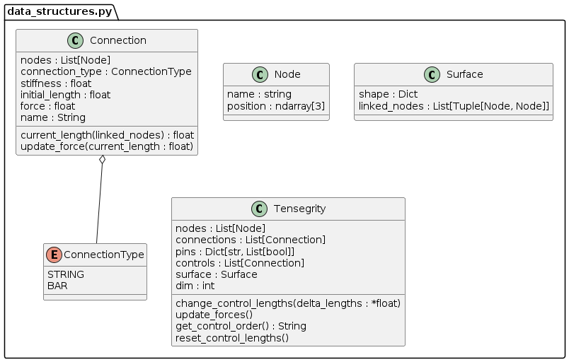
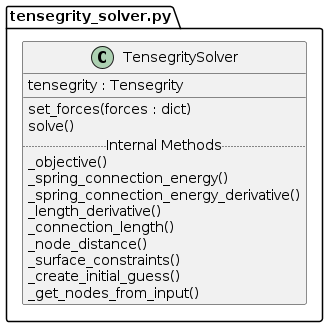
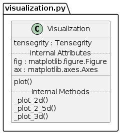

# Simulation Setup

The `main()` function in `main.py` can be changed to run the simulation as desired.

The primary parts to the simulations are:
* The YamlParser
* The Visualization
* The TensegritySolver

## Parser
This should be the first step to running the simulation. The takes the input yaml file from the commandline and creates the Tensegrity object.

```python
from TensegritySim import YamlParser

# Load the tensegrity system from the YAML file
tensegrity_system = YamlParser.parse(file)
```

## Visualizer
The `Visualization` class takes in a `Tensegrity` object and can then be used to plot the tensegrity system using the `plot()` method.

```python
from TensegritySim import Visualization as Viz

# Create the visualization object
viz = Viz(tensegrity_system)

viz.plot(label_nodes=True, label_connections=True)
```

## TensegritySolver
The `TensegritySolver` class takes in a `Tensegrity` object and can then be used to solve the system using the `solve()` method. 

```python
from TensegritySim import TensegritySolver

# Create the TensegritySolver object
solver = TensegritySolver(tensegrity_system)

# Manipulate the tensegrity system
tensegrity_system.change_control_lengths(-0.5)

solver.solve()
```

## UML Class Diagrams



